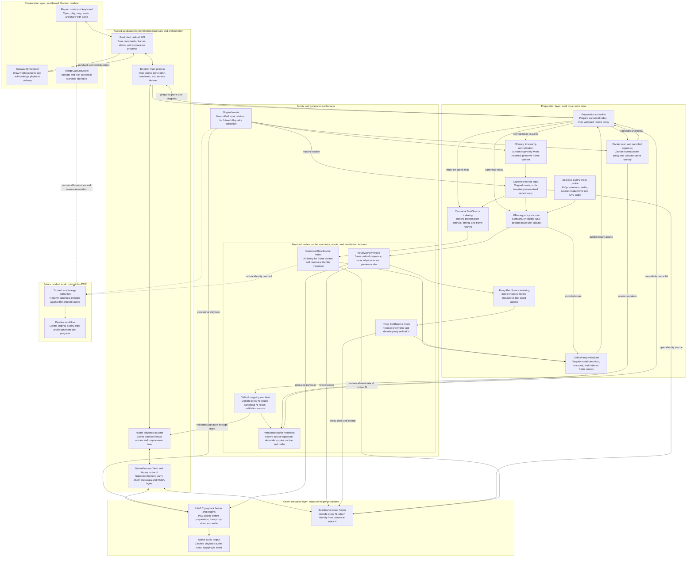

# Prepared-review C2 architecture

Verified against the isolated Windows x64 POC on 2026-08-30. This describes the selected
implementation, not an integrated product. Read [integration handoff](frame-scrub-supporting-player-control-integration-handoof.md)
for code ownership and [spike results](spike-results.md) for measured coverage and limitations.

Solid arrows show existing control/data flow. Dashed arrows show future extraction only.
Each node includes its role. The cache is a collection of generated assets, not another decoder.

## How to read the two clocks

1. Preparation builds the canonical index over the original or normalized input. A normalized
   input preserves frame content/ordinals, but its canonical PTS/timebase can differ from the
   original container's timestamps.
2. The selected proxy preserves source-relative presentation timing on a 60,000-tick clock,
   advancing duplicate/backward timestamps as needed. It is not the earlier constant ordinal-clock
   experiment. The proxy and canonical indexes remain distinct even when their times agree.
3. During prepared playback, LibVLC reports proxy time. The exact helper finds the proxy ordinal,
   decodes that picture, and attaches canonical index metadata for the same ordinal. Returning to
   playback seeks using `DisplayFrame.reviewTimeUs`, not canonical `identity.pts`.
4. Before preparation completes, the original movie can play, but exact controls and range capture
   stay disabled. A completed preparation switches playback to the mapped proxy.

The runtime's mapping validation checks complete frame counts, not pixel equality at every
ordinal. Synthetic fixture picture oracles and sampled real-media/timing checks provide the
additional measured evidence. Lossy proxy pixels are never original-quality export pixels.
The future extraction arrows require new implementation and tests; no clip files are created today.

## Code anchors

- Renderer: `src/ui/control-app.ts`, `src/ui/keyboard-controller.ts`,
  `src/model/range-capture-model.ts`, and `electron/control.html`.
- Boundary/orchestration: `electron/control-preload.cjs`, `electron/main.cjs`,
  `src/adapter/hybrid-frame-playback-adapter.ts`, `src/adapter/native-process-client.ts`,
  and `src/adapter/binary-frame-protocol.ts`.
- Preparation: `src/preparation/interactive-preparation.mjs`,
  `src/preparation/preparation-coordinator.mjs`, `src/preparation/all-intra-proxy-preparation.mjs`,
  `src/preparation/review-proxy-encoder.mjs`, and `src/preparation/proxy-acceleration-policy.mjs`.
- Native: `native/bestsource-gate/`, `native/media-service/bestsource_media_service.cpp`,
  `native/media-service/libvlc_media_service.cpp`, and `native/common/protocol.cpp`.
