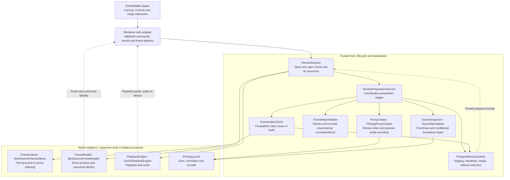

# Reusable video player backend design

Status: proposed component design, grounded in the Windows POC on 2026-08-30.
These are intended responsibilities and contract sketches, not classes already implemented
under these names. Final APIs and implementation belong in the next signed-off component spec/plan.
No playback engine change or new media experiment is proposed here.

The [integration handoff](frame-scrub-supporting-player-control-integration-handoof.md) describes the selected stack and its evidence.
The [architecture diagram](architecture-diagram.md) describes the current POC's data flow;
the diagram below describes the proposed software boundaries. Repository
[design guidance](../../../coding-quality.md) and the
[agent architecture map](../../../docs/agent-docs/agent-architecture-map.md) remain authoritative.

## Goal and placement

Opening a movie should provide ordinary playback promptly, prepare reusable exact-review assets
with visible progress, and then support fast canonical-frame access without rebuilding those assets
on every open. The backend must not own pipelines, clip naming, range editing, or clip export.

Keep this backend and the embeddable player in an isolated component folder with their own build
and dependencies. The production app supplies adapters and composes the component; the component
must not import application controllers or pipeline models. Its renderer-facing adapter fits the
app's existing `src/ui/` and `src/adapters/` boundaries without copying the spike's main process wholesale.

Preparation orchestration runs in the trusted host, initially Electron main. Expensive scans,
decoding, indexing, and encoding run in child processes, not on the renderer or main event loop.
Keep Electron IPC, executable discovery, and OS paths in the composition/adapter layer. Interface
notation below uses TypeScript for clarity; the existing native implementation remains C++.

### First-stage preparation scope

Agreed on 2026-08-31: the first integrated control uses software FFmpeg proxy generation and
software BestSource indexing only. QSV is not included, even as a disabled implementation.
Do not port hardware detection, acceleration selectors/fallback wrappers, QSV command builders,
accelerated native packages or hardware feature flags. `ProxyCreator` remains an implementation
boundary, not a requirement to build a second backend now. Preserve the experimental code and
measurements in the isolated spike; any later hardware adoption needs separate qualification.
See the [hardware decision](frame-scrub-supporting-player-control-integration-handoof.md#hardware-acceleration-bottom-line).

## Components and ownership

| Component | Responsibility and lifetime | Explicitly not responsible for |
| --- | --- | --- |
| `ReviewPreparationService` | Coordinates one preparation job: validate/cache lookup, normalize if needed, canonical index, proxy, proxy index, mapping validation, publication. Inject its collaborators. | FFmpeg arguments, BestSource internals, UI state, playback scheduling. |
| `SourceInspector` | Inspects selected tracks and source freshness. Uses sampled signatures for reopen and the deeper packet scan when preparation policy requires it. | Promising exact frame identity from container metadata or nominal FPS. |
| `SourceNormalizer` / `FfmpegSourceNormalizer` | Makes a stream-copy timestamp-repaired derivative only when policy requires it; supplies validation evidence and original-source provenance. | Lossy proxy encoding or unconditional rewriting of healthy input. |
| `FrameIndexer` / `BestSourceFrameIndexer` | Builds a complete index for a supplied media asset and selected video track; reports progress, counts, backend identity, and metadata. Uses the native helper. | Cache policy, proxy generation, interactive seek state. |
| `FrameIndexCache` | Reuses compatible persistent indexes or invokes its injected `FrameIndexer` on a miss. Serves both canonical and proxy indexing. | Keeping decoded pictures in RAM or treating an incomplete index as usable. |
| `ProxyCreator` / `FfmpegProxyCreator` | Encodes the selected review profile, including timing, dimensions, and chosen preview audio, through the software FFmpeg encoder only. | Indexing its output, approving its frame map, publishing readiness, hardware selection. |
| `FrameMapValidator` | Validates the canonical/proxy relationship and records its evidence/version. Creates the validated map consumed by exact review. Pure checks can remain functions. | Claiming lossy proxy pixels equal source pixels or count equality alone proves correspondence. |
| `PreparedReviewCache` | Owns the on-disk prepared media, manifests, index files, mapping records, staging, publication, pins, and eviction. Publishes a ready bundle only with all dependencies validated. | Encoding/decoding or storing user-authored ranges as disposable cache data. |
| `FrameReader` / `BestSourceFrameReader` | Opens prepared indexes and returns exact proxy pictures with canonical identity. A per-open native reader owns decoder state and bounded decoded-picture caches. | Building indexes silently during interaction or supplying the ordinary playback clock. |
| `PlaybackEngine` / `LibVlcPlaybackEngine` | Ordinary playback, audio, rate, and time seeking. Plays the original provisionally, then the prepared proxy. | Establishing absolute source-frame identity from a sampled playback clock. |
| `ReviewSession` | One open movie's lifecycle: preparation subscription, asset pins, engine/reader handles, source generation, mode transitions, scrub/step schedulers, and disposal. | Persistent cache eviction, DOM rendering, q/w/a range rules, or pipeline insertion. |

`PreparedReviewCache` is the single physical storage/lifetime owner. `FrameIndexCache` is its
index-specific collaborator, not a second independent cache directory or eviction system. This
split lets indexing change without duplicating source/proxy lifecycle policy. There is no need
for a separate `ProxyCache`, generic service locator, or database in the first integration.
The files are recreatable artifacts and BestSource indexes are opaque native files, not relational
application state. Preserve the existing storage layout initially unless a migration earns its cost.



The diagram shows responsibility/dependency flow, not an extra process per class. Reuse the
existing binary helper protocol and bounded delivery; these interfaces must not add another IPC
round trip for each property of a frame. Return pixels and associated metadata together.

## Main contracts

The following named values prevent mixing media, indexes, and clocks:

- `OpenedMovie`: trusted reference to the original file and selected tracks, bound to a source
  revision. Renderer messages use an opaque session/source handle, not arbitrary native paths.
- `SelectedVideoSource`: a specific original, normalized, or proxy asset plus its video track and
  validated artifact identity. An index is valid for this pair, not for a filename alone.
- `CanonicalIndexedSource`: the canonical asset/index and provenance back to the original movie.
  If normalization repaired timestamps, its PTS can differ from the original container's PTS.
- `PreparedReview`: immutable validated bundle of original-source association, canonical asset/index,
  proxy asset/index, preview-audio selection, frame map, and preparation/version identity.
- `PreparedReviewLease`: a pin on that bundle and all dependencies until `release()`. Immutable
  metadata does not itself keep files alive; a session or background consumer must hold a lease.
- `IDisplayFrame`: viewport pixels with canonical `ISourceFrameIdentity`, proxy `reviewTimeUs`, and
  source generation. A delivery sequence number is not a canonical frame ordinal.

BestSource owns its full index format. JavaScript holds opaque artifact references and bounded
metadata, not an array of every decoded picture or an in-memory copy of the movie. Both indexes
can use the same `FrameIndexer` implementation; their *roles* and media inputs remain distinct.

Contract sketches, with request/value details abbreviated:

```typescript
interface JobContext {
  readonly signal: AbortSignal;
  readonly onProgress: (progress: PreparationProgress) => void;
}

interface FrameIndexer {
  readonly identity: IndexerIdentity; // Backend/build/options used in index cache identity.
  build(request: {
    source: SelectedVideoSource;
    output: IndexStagingArea;
  }, job: JobContext): Promise<BuiltFrameIndex>;
}

interface ProxyCreator {
  create(request: {
    canonical: CanonicalIndexedSource;
    profile: ReviewProxyProfile;
    output: MediaStagingArea;
  }, job: JobContext): Promise<BuiltProxy>;
}

interface FrameReader {
  open(review: PreparedReview, job: JobContext): Promise<ExactFrameSession>;
}

interface ExactFrameSession {
  getFrame(ordinal: FrameOrdinal): Promise<IDisplayFrame>;
  step(direction: StepDirection): Promise<IDisplayFrame>;
  dispose(): Promise<void>;
}
```

`FrameIndexCache.getOrBuild(source, workspace, job)` hides lookup, compatibility checks and the
injected indexer. It returns an internal index artifact, possibly still in the job's staging area;
that is not a `PreparedReview`. `ReviewPreparationService.acquire(request, job)` returns a
`PreparedReviewLease` only after validation and publication, or a lease on a valid cache hit.
Only the preparation boundary constructs `PreparedReview`; arbitrary JSON cannot assert readiness.
Readers reject an incompatible/missing index back to preparation rather than silently reindexing.

`FrameOrdinal` is a validated non-negative safe integer; the reader also checks it against the
pinned movie's bounds. `StepDirection` is forward/backward, not a loosely interpreted numeric
offset. `getFrame` establishes the delivered cursor; `step` before that reports `not-positioned`.
The session primes this cursor before enabling stepping. `step` is relative to the last delivered
exact frame and retains the measured adaptive BestSource/cache behavior;
it must not force linear decode from a stale decoder cursor after a distant cached jump.
Keep integer PTS, duration and rational timebase intact; serialize bigint fields as decimal strings.
Timeline lookup returns a canonical result through the proxy index/map, never `seconds * FPS`.

### Typical callers

These sketches exercise lifecycle and ownership before fixing the final public API:

```typescript
// 1. Interactive open: the backend factory wires a per-movie ReviewSession.
// open resolves when provisional display is available, not after full preparation.
const session = await backend.open({ movie, onPreparationProgress, onStateChanged });
await session.play();
// Preparation continues independently; the UI exposes exact controls only when ready.

// 2. Source switch/close: disposal invalidates deliveries and releases owned resources.
await session.dispose();
const nextSession = await backend.open({ movie: nextMovie, onPreparationProgress, onStateChanged });
// The owner must also dispose nextSession when its player closes.

// 3. Non-UI consumer, e.g. a gate test or later analysis job: same cache/preparation path.
const prepared = await preparation.acquire({ movie, profile }, job);
try {
  const reader = await frameReader.open(prepared.review, job);
  try {
    const frame = await reader.getFrame(frameOrdinal(1200));
    consume(frame.identity);
  } finally {
    await reader.dispose();
  }
} finally {
  await prepared.release();
}
```

The interactive `ReviewSession` owns its preparation lease and its reader; callers of that facade
must not separately release either. A headless caller owns the resources it explicitly acquires.
`dispose()`/`release()` are idempotent. A failed open releases any partially acquired resources.
An embedder owns sessions explicitly; no process-global current movie or cache singleton is needed.

## Preparation flow

1. Open the original for provisional playback. Inspect source/track identity and validate the
   sampled freshness signature. Report preparation independently of playback state.
2. Look up the prepared bundle. On a hit, validate all referenced artifacts and acquire pins.
   On a miss, reuse compatible completed artifacts where possible; repair timestamps only under
   the existing policy. Preserve the original source and record derivative provenance.
3. Use `FrameIndexCache` to acquire/build the canonical index. Then ask `ProxyCreator` to encode
   the selected profile, and use the same index cache/indexer contract to index the proxy.
   These are separate passes in the selected design, not the deferred shared-pass optimization.
4. Validate mapping and publish. Counts must agree, order must be preserved, and timing/fixture
   evidence must satisfy the selected mapping contract. Store the validation version and evidence;
   do not interpret the current POC's count checks as exhaustive per-picture proof.
5. `ReviewSession` activates the pinned proxy for both LibVLC and exact review, retaining the
   canonical index for identity. Translate the playback position through the two timelines and
   preserve play/pause state. Declare exact readiness only after the native reader opens successfully.

Expose separate playback and preparation states. Preparation has `validating-cache`, `normalizing`,
`indexing-canonical`, `encoding-proxy`, `indexing-proxy`, `validating-map`, `ready`, `failed`, and
`cancelled` states; optional phases are skipped. Progress includes stage, elapsed time, known work
counts and an optional ETA. Do not invent a percentage or ETA when the underlying tool cannot supply
one. A preparation failure can leave ordinary playback usable but must disable exact capture/access.

## Cache and job lifecycle

`PreparedReviewCache` owns cache paths and atomic workspaces. `FrameIndexCache` owns index-specific
compatibility and build-on-miss behavior. A proxy profile change must not unnecessarily rebuild a
still-compatible canonical index. The cache keys/dependencies are:

| Artifact | Identity inputs |
| --- | --- |
| Canonical asset/provenance | Original source signature/revision, selected track, normalization policy/version and evidence. Healthy input references the original without copying it. |
| Frame index | Actual indexed asset identity, selected video track, BestSource/FFmpeg build identities, index format and indexing options. |
| Proxy media | Canonical asset identity, timing/mapping recipe, video profile, selected audio and audio profile, software encoder identity/build/contract. |
| Ready review bundle | Canonical and proxy artifact/index identities, mapping-validation version and evidence. |

Sampled signatures detect ordinary replacement/change probabilistically, not edits anywhere with
mathematical certainty. Reuse the approved sampling policy and persist its version/selection rules;
do not pick unrelated random windows on every reopen. Track source file identity/size/modification
before and after preparation, and reject observable mid-job changes. This is not protection against
undetectable edits outside the sample; stronger validation remains a separate policy when needed.

When importing a spike cache, validate the software encoder provenance as well as the profile.
Do not silently treat an experimental QSV-produced proxy as first-stage-qualified because its
codec/profile matches. Compatible canonical indexes can still be reused independently.

Publication happens only after workers close their output files. A bundle cannot reference partial
or absent dependencies; index references use artifact identity rather than temporary filenames.
Complete sub-artifacts may be retained for retry, but none alone grants exact-review readiness.
Handle incompatible/corrupt entries as classified invalidations; do not hide permission/disk failures
as innocent cache misses. Never replace or rewrite the original movie.

Use one writer per preparation identity in the trusted host. If multiple sessions share a job,
each owns a subscription: cancelling one detaches it; the last cancellation aborts the workers.
Independent app instances require an exclusive cache-write lock, or distinct cache roots until
that locking is implemented. No two processes may publish competing partial results unsafely.

Cancellation and failures kill/wait for the job's child processes, then clean only its staging area.
Source generations reject stale frames/progress after switching movies. Exact seeks use bounded
latest-target scheduling; held adjacent stepping has its separate paced scheduler. Session disposal
stops scheduling, closes engines/readers, and releases pins. Eviction removes only unpinned complete
bundles/dependencies under the configured cache root; source media and user-saved ranges are never
evicted. Initially, a shared native cache root can retain completed artifacts without automatic eviction.

Three different caches must remain explicit: persistent BestSource index files, persistent review
media/maps, and per-reader in-memory decoded pictures. The first two avoid repeated preparation;
the third speeds nearby stepping and is discarded when the native reader closes.

Report typed failure categories with stage/context: unsupported media, source changed, incompatible
index, invalid map, cache I/O, native process failure, timeout, or cancellation. Preserve technical
details in bounded logs and emit concise user-facing events. Use per-operation time budgets;
multi-minute preparation is not an interactive-seek timeout. Cancellation must not be converted into a retry.

## Exact capture is a separate correctness contract

Preparation readiness does **not** prove that a live playback picture has an exact identity.
Paused exact-review frames already carry canonical identity; while playing, the POC currently
uses a sampled LibVLC clock and a nearest-index lookup. That is a remaining correctness gap for
q/w capturing the picture visible at keydown, not an accepted weakening of the product requirement.

The future presentation contract must bind an exact identity to the actual displayed picture and
its source generation. The renderer must snapshot that association synchronously at q/w keydown,
not ask for a newer playback clock over IPC. Exact-review delivery can supply this today; the
LibVLC callback path still needs a proved picture-to-canonical-identity mechanism. A callback
sequence number or approximate timestamp must not be labeled an exact displayed-frame identity.
Keep approximate playback position and exact displayed-frame capture as separate capabilities.

Range editing/locking remains in `RangeCaptureModel`, outside these backend services. Persist a
range with its original-source association and canonical endpoints, not just two preview timestamps.
Future extraction must validate the original and resolve those ordinals in the original picture
sequence; repaired canonical PTS and proxy PTS are not directly usable as original-source seek times.
Export boundary/audio semantics and end-to-end first/last-picture tests remain new work.

## Migration from the POC

| Current code | Intended destination |
| --- | --- |
| `interactive-preparation.mjs`, `preparation-coordinator.mjs` | `ReviewPreparationService`; move source inspection, normalization and index building behind their contracts without changing preparation policy. |
| `preparation-cache.mjs` plus proxy workspace/manifest functions | `PreparedReviewCache` physical storage and `FrameIndexCache` index-specific reuse. Preserve or explicitly migrate existing entries. |
| Index/probe calls in both preparation services | One `BestSourceFrameIndexer` used for canonical and proxy assets. |
| `all-intra-proxy-preparation.mjs` | Separate encoding into `FfmpegProxyCreator`, indexing into `FrameIndexCache`, mapping checks into `FrameMapValidator`, and sequencing into the preparation service. |
| `FfmpegCliReviewProxyEncoder` in `review-proxy-encoder.mjs` | Reuse the software encoder behind `FfmpegProxyCreator`; do not port the acceleration policy/fallback composition. |
| `proxy-acceleration-policy.mjs`, `ffmpeg-hardware-diagnostic.mjs`, accelerated bootstrap/runtime | Leave in the isolated experiment; exclude from first-stage component code, dependencies and packaging. |
| `hybrid-frame-playback-adapter.ts` | Playback/exact transition logic inside `ReviewSession`, with injected engine/reader and explicit lifecycle ownership. |
| `bestsource-frame-playback-adapter.ts`, `libvlc-playback-adapter.ts`, native services | Implement `FrameReader` and `PlaybackEngine`; keep native library details behind these adapters. |
| `native-process-client.ts`, main/preload wiring | Internal process transport and a thin Electron composition/bridge layer, not domain/cache logic. |

All paths above are under the spike's `src/preparation/` or `src/adapter/` unless stated otherwise;
the [handoff source map](frame-scrub-supporting-player-control-integration-handoof.md#selected-implementation) gives full locations.
Extract responsibilities incrementally with regression tests; do not rewrite the proved native
algorithms just to achieve these names. A stateless policy/validator need not become a class.

## Integration acceptance

- First-stage code and package composition contain no QSV backend, hardware selection/capability
  checks, acceleration-specific dependencies or disabled hardware feature flag.
- A caller-level test injects counting fake `FrameIndexer`/`ProxyCreator` implementations: a cold
  prepare builds both indexes and one proxy; a valid warm reopen invokes neither expensive builder.
- A new proxy profile reuses the canonical index but rebuilds affected proxy dependencies. Source,
  track, build, option and mapping-contract changes invalidate the appropriate dependent artifacts.
- Cancellation/failure cannot publish readiness or leak children/staging. Source switching rejects
  stale deliveries; shared-job cancellation and lease-protected cache deletion are exercised.
- Full native integration verifies VFR, repaired timestamps, equal-looking repeated frames,
  random-to-adjacent transitions, and canonical identity before/after reopen. Do not hide historical
  initial-probe discrepancies behind the new cache interface.
- Delayed IPC and queued playback frames prove q/w matches the displayed picture, not a later or
  approximate clock lookup. Until that passes, live exact capture is not complete.
- Real Electron playback/audio, continuous dragging/stepping, resource stability and failure UI
  retain the measured behavior. Interface refactoring must not add per-frame round trips.
- When export is implemented, separately verify the original-source first and last pictures and
  audio boundaries for captured ranges, including normalized inputs.

Design review basis: `coding-quality.md`, `api-and-interface-design`, `domain-modeling`,
`error-and-correctness-traps`, and `doc-update`. The production architecture map is intentionally
unchanged: this is a proposed integration design, not an implemented production subsystem.
